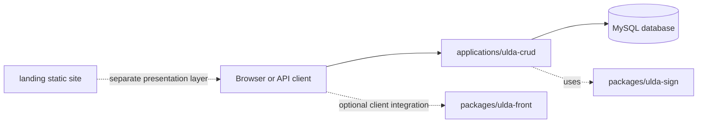

# Deployment Guide

## Scope

This repository is a ULDA research workspace, not a single monolithic production system. For deployment-oriented work, the main target is:

- `applications/ulda-crud`

It is the most realistic server-side application in the repository because it exposes HTTP and Socket.IO interfaces and persists records in MySQL.

Supporting repository parts in this deployment model:

- `packages/ulda-sign` provides ULDA signing and verification logic used by the server.
- `packages/ulda-front` is a client-side integration layer and is not deployed as a standalone backend service.
- `applications/example-password-keeper` and `applications/max_speed_test_server` remain demo/support applications.
- `landing/` can be published separately as a static presentation layer, for example via GitHub Pages.

## Architecture overview

The deployed demo system consists of a browser/client, the `ulda-crud` Node.js application server, and a MySQL database. ULDA package code is consumed by the application server from the same repository.



## Demo-oriented hardware requirements

These values are appropriate for coursework, demonstrations, and small-scale internal evaluation. They are not a production sizing guarantee.

- CPU: 2 logical cores
- RAM: 4 GB minimum, 8 GB recommended
- Disk: 10 GB free space for repository, npm cache, logs, and MySQL data

If Docker is used for MySQL or the full application stack, allocate additional disk space for container images and volumes.

## Required software

- Git
- Node.js 18 or newer
- npm
- MySQL 8.0 or newer

Optional but practical:

- Docker Engine or Docker Desktop
- MySQL command-line client or MySQL Workbench
- a reverse proxy such as Nginx only if the demo is exposed beyond localhost

## Network requirements

For a local demo deployment, the following ports are usually sufficient:

- application HTTP port: `8787` by default
- MySQL TCP port: `3306`

If the application is exposed to other machines:

- allow inbound traffic to the application port
- restrict database exposure to trusted hosts only
- prefer keeping MySQL bound to localhost or a private network

## Server configuration

The application reads runtime configuration from environment variables. Start from:

- `applications/ulda-crud/.env.example`

Important variables:

- `PORT`
- `ORIGIN_SIZE`
- `SIGN_N`
- `SIGN_MODE`
- `SIGN_HASH`
- `CONTENT_BYTES`
- `LOG_REQUESTS`
- `DB_HOST`
- `DB_PORT`
- `DB_USER`
- `DB_PASSWORD`
- `DB_NAME`
- `DB_POOL_LIMIT`

The server can also attempt a Docker-based MySQL fallback when `DB_DOCKER_ENABLE=true`, but for reproducible deployments it is better to prepare the database explicitly instead of relying on automatic fallback.

## Database setup

### Option 1: existing MySQL server

1. Install MySQL 8.0 or newer.
2. Create a database and user matching the intended `.env` values.
3. Copy the example environment file:

```bash
cd applications/ulda-crud
cp .env.example .env
```

4. Adjust at least:

- `DB_HOST`
- `DB_PORT`
- `DB_USER`
- `DB_PASSWORD`
- `DB_NAME`

When the application starts successfully, it creates the `main` table automatically if it is missing.

### Option 2: Docker-backed MySQL

If Docker is available, the application can start a MySQL container automatically when the configured database is unreachable and `DB_DOCKER_ENABLE=true`.

For predictable deployments, prefer using the dedicated container files documented later in this guide instead of relying on implicit fallback startup.

## Code deployment steps

### Standard host-based deployment

1. Clone the repository:

```bash
git clone https://github.com/iammarguuss/ulda-bachelor.git
cd ulda-bachelor
```

2. Install root-level maintenance tooling:

```bash
npm install
```

3. Install application dependencies:

```bash
cd applications/ulda-crud
npm install
```

4. Prepare configuration:

```bash
cp .env.example .env
```

5. Review database settings and runtime port.
6. Start the server:

```bash
npm run dev
```

The same application can also be started directly with:

```bash
node src/server.js
```

### Optional container deployment

This repository also includes a simple container-based option for the same deployment target:

- `applications/ulda-crud/Dockerfile`
- `applications/ulda-crud/docker-compose.yml`
- `applications/ulda-crud/.dockerignore`

Prepare `.env` first:

```bash
cd applications/ulda-crud
cp .env.example .env
```

Example:

```bash
cd applications/ulda-crud
docker compose up --build -d
```

## Verification after deployment

After startup, verify the following:

1. Health endpoint:

```bash
curl http://localhost:8787/health
```

Expected result: JSON with `"ok": true`.

2. Configuration endpoint:

```bash
curl http://localhost:8787/config
```

Expected result: JSON describing ULDA-related runtime parameters.

3. Browser test page:

- open `http://localhost:8787/browser-test/`

4. If MySQL is external, confirm that the target database contains table `main`.

For the compose-based setup, you can also verify running containers:

```bash
cd applications/ulda-crud
docker compose ps
```

## Operational notes

- This deployment target is a research/demo service, not a hardened production stack.
- The server currently uses permissive CORS and does not implement a full authentication model.
- Exposing the service to untrusted public traffic should be treated as an experiment only and requires additional hardening outside the current repository scope.
